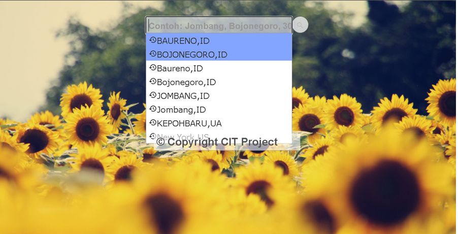

# Weather Web App

Basic [weather web app](https://maspirman.github.io/weather-app-coba/) employing public API.

Developed as a part of 
[Task 10 of Kottans FrontEnd Course](https://github.com/kottans/frontend/blob/master/test10.md)

<!-- START doctoc generated TOC please keep comment here to allow auto update -->
<!-- DON'T EDIT THIS SECTION, INSTEAD RE-RUN doctoc TO UPDATE -->
## Table of Contents

- [Features](#features)
- [Known Issues](#known-issues)
- [Installing and building the project](#installing-and-building-the-project)
- [Deployment](#deployment)
- [Resources](#resources)
- [Time Track](#time-track)

<!-- END doctoc generated TOC please keep comment here to allow auto update -->

### Features

*	Pencarian Berdasarkan Nama Kota/Daerah
*	Pencarian Berdasarakan GOE Cordinates
*	Menampilkan Cuaca saat ini , Hari ini, dan ramalan 5 hari Kedepan
*	Menyimpan  history 20 kota terbaru yang dicari, tersedia di trek riwayat (disimpan di browser).
*	Beralih antara unit imperial dan metrik (disimpan di browser)
*	Menggunakan API Open Weather Map Untuk Data Sourcenya.

[App architecture](./architecture.md)

[_-- TOC --_](#table-of-contents)

### Known Issues

 - [ ] tampilan masih kurang bagus
 - [ ] Penghapusan data perkiraan dilakukan bukan melalui manajemen
 - [ ] tidak mendeteksi lokasi terkini
 - [ ] Pre-loaded kota/daerah belum terintegrasi
 - [ ] favorite masih belum berfungsi
 - [ ] Favourites drop-down is not implemented
 - [ ] pencrian melalui geo corditates masih erir dan hanya menampilkan data daerah

[_-- TOC --_](#table-of-contents)

### Instal dan build project
merujuk pada [building the project](./BUILD.md) untuk detail.

[_-- TOC --_](#table-of-contents)

### Deployment

**Deploy to github pages, untracked `dist/` only**
using [push-dir](https://www.npmjs.com/package/push-dir)

`yarn global add push-dir` or `npm install --global push-dir` once

`push-dir --dir=dist --branch=gh-pages --cleanup --verbose`

[_-- TOC --_](#table-of-contents)

### Resources

 * [Autocomplete API](https://serbian.wunderground.com/weather/api/d/docs?d=autocomplete-api)

[_-- TOC --_](#table-of-contents)

